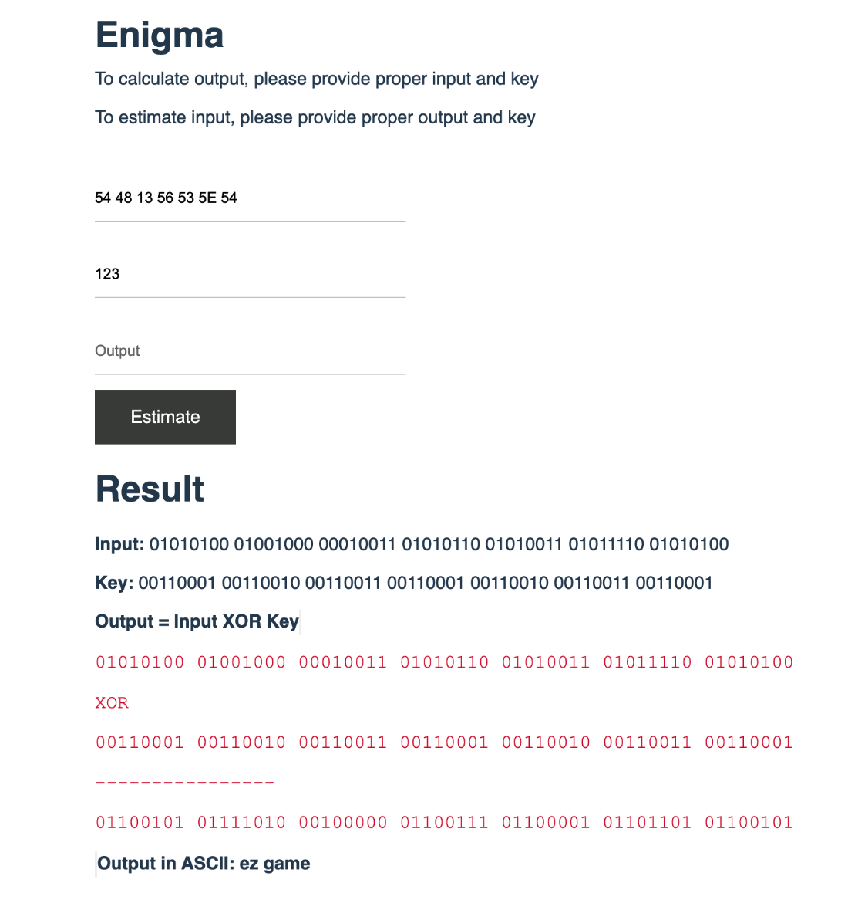

# DF Engima

## Live demo

[DEMO](https://3enigma.netlify.app/)

## Sample
- Input: 54 48 13 56 53 5E 54
- Output: ez game
- Key: 123

  

## Source 

https://www.dcode.fr/xor-cipher

## Rule

### What is the XOR cipher? (Definition)

**XOR** Encryption uses the **XOR** operator (**Exclusive Or, symbol: ⊕**) with the plain text and the key as operand (that should be binary encoded).

### How to encrypt using XOR cipher?

**XOR** is applied on binary data, a conversion (ASCII or Unicode) must be carried out on a non-binary text.

**Example:**

>The plain message is 1001 and the key is 10

>Take the first bit (0 or 1) of the plain text and the first bit of the key and multiply then using XOR operation to get the ciphered bit.

**Example:**

 > 1 ⊕ 1 = 0

> The operation is repeated with the second bit of the plaintext and the second bit of the key. At the end of the key, loop back to the first bit.

**Example:**
```
Plain message
1001
Key (repeated)
1010
Encrypted message
0011
```

### How to decrypt XOR cipher?
**XOR** Decryption is identical to encryption because the XOR operation is symmetrical (**reverse** **XOR = XOR**).

**Example:**
```
1001 ⊕ 1010 = 0011 and 0011 ⊕ 1010 = 1001
```

### How to convert a text into binary?
dCode uses the ASCII table encoding which associates with characters (including the letters of the alphabet) a number between 0 and 128, which is then converted to base 2 (binary). It is possible to use other methods to get binary encoded text.

### What is the truth table for XOR?
The truth table of the 2-parameter XOR logic function is:

| A | B | A XOR B|
|---|---|--------|
| 0 | 0 | 0      |
| 0 | 1 | 1      |
| 1 | 0 | 1      |
| 1 | 1 | 0      |
